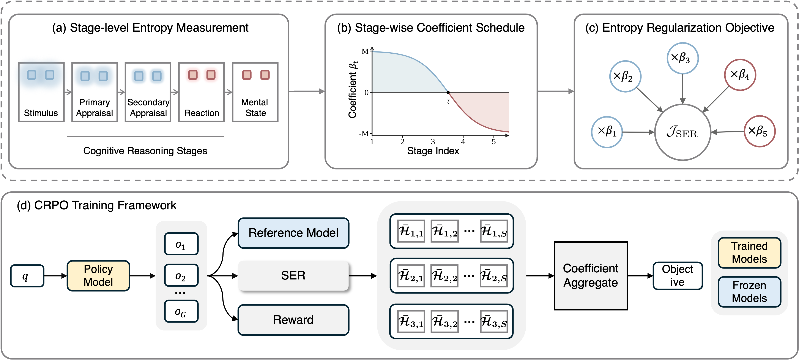

# Mental-R1: Aligning LLM Reasoning for Mental Health Assessment

<!-- **Cognitive Relative Policy Optimization (CRPO) for structured, text-based mental health assessment.** -->

This repository contains the official implementation of **Cognitive Relative Policy Optimization (CRPO)**, the reinforcement learning framework used to train **Mental-R1**, as presented in our paper *Mental-R1: Aligning LLM Reasoning for Mental Health Assessment*. Please refer to the paper for a full description of the method.

<p align="center">
  
</p>

## Contents

- [Environment and Installation](#environment-and-installation)
- [Benchmark Tasks](#benchmark-tasks)
- [Training](#training)
- [Citation](#citation)

## Environment and Installation

The training setup uses Linux, CUDA-capable NVIDIA GPUs with bf16 support, and DeepSpeed. The experiments described in the paper used eight NVIDIA RTX PRO 6000 GPUs.

The code targets TRL 0.21.0 and overrides internal trainer methods. Use the validated training environment's versions of PyTorch, Transformers, Accelerate, DeepSpeed, Datasets, pandas, and TensorBoard when preparing `requirements.txt`.

From the repository directory, install the pinned dependencies into an environment with a suitable CUDA-enabled PyTorch build:

```bash
python -m pip install -r requirements.txt
```

The launch instructions below assume the single-file training script is named `train.py` and the actual DeepSpeed configuration is supplied as `deepspeed_zero2.json`.

## Benchmark Tasks

| Dataset | Assessment task | Output labels in the paper's prompt templates |
|---|---|---|
| DATD | Anxiety or depression risk | `Yes`, `No` |
| RSD | Suicide-related content severity | `Indicator`, `Ideation`, `Behavior`, `Attempt` |
| DepSeverity | Depression severity | `Minimum`, `Mild`, `Moderate`, `Severe` |
| LT-EDI | Depression risk level | `Not depressed`, `Moderately depressed`, `Severely depressed` |
| SDCNL | Suicide risk | `Yes`, `No` |
| Dreaddit | Psychological stress | `Yes`, `No` |
| FIG | Loneliness detection | `Yes`, `No` |
| LID | Loneliness intensity | `[1–2]`, `[2–3]`, `[3–4]`, `[4–5]` |


## Training

### 1. Configure Local Paths

Edit the following settings in `train.py` for your environment:

```python
model_name = "/path/to/Qwen3-8B"
root_folder = "/path/to/dataset_new"
```

Inside `GRPOConfig`, configure the output directory and the supplied DeepSpeed configuration:

```python
output_dir="./runs/mental-r1",
deepspeed="deepspeed_zero2.json",
```

The model directory must contain a Transformers-compatible Qwen3-8B checkpoint and its tokenizer. The DeepSpeed file should specify the ZeRO-2 setup used for the run. Relative paths are resolved from the directory where training is launched.

The current script assigns `HF_ENDPOINT` to `https://hf-mirror.com`. Edit or remove that assignment to use your preferred Hugging Face endpoint.

### 2. Launch Distributed Training

For the eight-GPU, single-node setup described in the paper:

```bash
deepspeed --num_gpus=8 main.py
```

For another single-node setup, set `--num_gpus` to the number of GPUs assigned to the run.

### 3. Monitor and Save

TensorBoard reporting is enabled. Set `--logdir` to the configured output directory:

```bash
tensorboard --logdir ./runs/mental-r1
```

The script saves the final model through `trainer.save_model(output_dir)`. Automatic intermediate checkpoints are disabled with `save_strategy="no"`, and the current training call does not resume from a checkpoint.

## License

The code in this repository is licensed under the [Apache License 2.0](LICENSE). Portions of the trainer implementation are adapted from [Hugging Face TRL v0.21.0](https://github.com/huggingface/trl/tree/v0.21.0), with upstream copyright and license notices retained in `main.py`.
